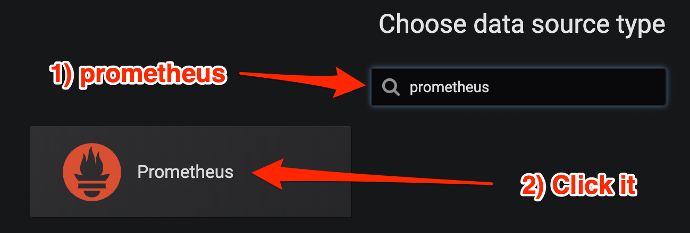
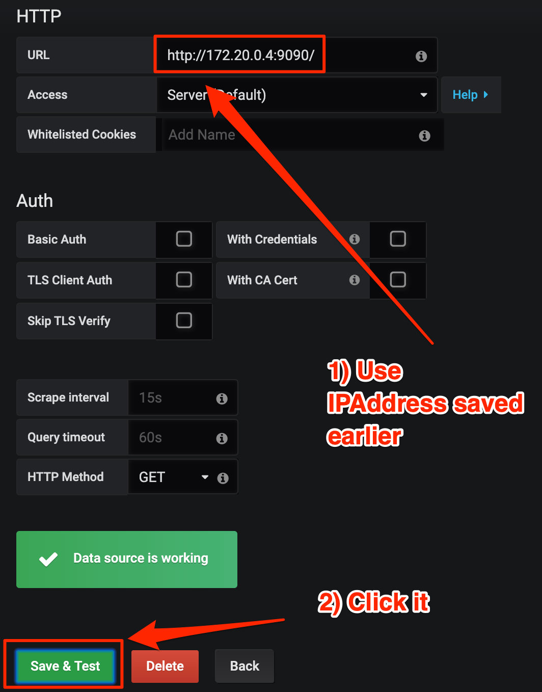
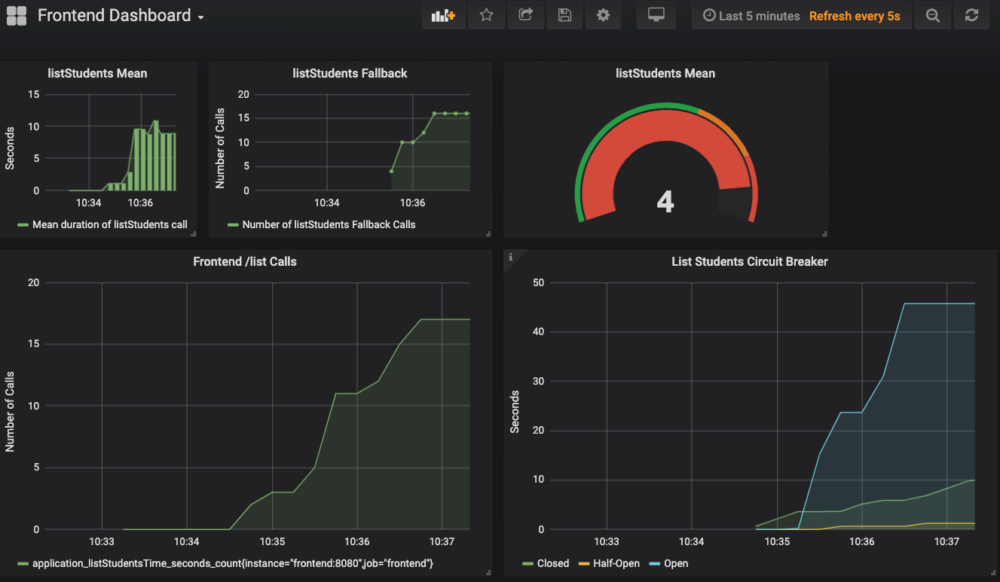

== Packaging, deploying, and monitoring

Build applications as a thin jar files, package them as docker files and start them. Once running, view health endpoint state and view application metrics in grafana.

. Update student URI for docker deployment.
+
--
.frontend/src/main/java/org/acme/application.properties
[source,properties]
----
#StudentService/mp-rest/uri=http://localhost:8081 <1>
%dev.StudentService/mp-rest/uri=http://localhost:8081 <2>
%prod.StudentService/mp-rest/uri=http://student:8081 <3>
----
<1> Comment out current uri
<2> Properties prefixed with `%dev.` will be used while in development mode only (`mvn quarkus:dev`). 
<3> Properties prefixed with `%prod.` will be used when running in native mode or with `java -jar` only. When running via the docker-compose, the host will be "student".

NOTE: Quarkus supports multiple configuration profiles.  There is also a `%test.` profile when running tests. Properties with no profile defined are always utilized, as has been the case so far in this lab.
--
// *********************************************
'''

. Package applications as docker files
+
--

WARNING: Make sure docker daemon is running and is accessible (ex: `docker info` shows proper results)

.Package student as thin jar and create a docker image

[source,bash]
----
$ cd tutorial/working/student
$ mvn clean package -DskipTests
$ docker build -t acme/student:1.0 -f src/main/docker/Dockerfile.jvm .
----

.Package frontend as thin jar and create a docker image
----
$ cd tutorial/working/frontend
$ mvn clean package -DskipTests
$ docker build -t acme/frontend:1.0 -f src/main/docker/Dockerfile.jvm .
----
--
+
// *********************************************
'''

. Stop student and frontend apps running in development mode to avoid port conflicts
+
--
.Terminal 1
[source/bash]
----
# Press CTRL-C to stop Quarkus (student)
----

.Terminal 2
[source/bash]
----
# Press CTRL-C to stop Quarkus (frontend)
----
--
+
// *********************************************
'''

. Start student, frontend, prometheus, and grafana.
+
--
.Terminal 1
[source,bash]
----
$ cd tutorial/working/docker
$ docker-compose up
----
--
+
// *********************************************
'''

. View student service health
+
--

.Terminal 2
----
$ docker-compose ps
----
.Terminal 2 Output
....
    Name           Command          State           Ports    
-------------------------------------------------------------
docker_fronte   /deployments/   Up              0.0.0.0:8080-
nd_1            run-java.sh                     >8080/tcp,   
                                                8778/tcp,    
                                                9779/tcp     
docker_grafan   /run.sh         Up              0.0.0.0:3000-
a_1                                             >3000/tcp    
docker_prom_1   /bin/promethe   Up              0.0.0.0:9090-
                us --config.f                   >9090/tcp    
docker_studen   /deployments/   Up              8080/tcp, 0.0
t_1             run-java.sh     (unhealthy)     .0.0:8081->80 <1>
                                                81/tcp,      
                                                8778/tcp,    
                                                9779/tcp   
....

<1> Run `docker-compose ps` until both `(healthy)` and `(unhealthy)` are displayed. In container orchestration environment, these pods containers would be restarted.
--
+
// *********************************************
'''

. Get Prometheus IP address
+
--
.Terminal 2
[source, bash]
----
$ docker inspect docker_prom_1
----

.Terminal 2 Output
....
...
...
        "NetworkSettings": {
            "Bridge": "",
            "SandboxID": "acf7dc6b9591f7992fb3053639a38cc98f91281e98582b8a8a420026506d88b8",
            "HairpinMode": false,
            "LinkLocalIPv6Address": "",
            "LinkLocalIPv6PrefixLen": 0,
            "Ports": {
                "9090/tcp": [
                    {
                        "HostIp": "0.0.0.0",
                        "HostPort": "9090"
                    }
                ]
            },
            "SandboxKey": "/var/run/docker/netns/acf7dc6b9591",
            "SecondaryIPAddresses": null,
            "SecondaryIPv6Addresses": null,
            "EndpointID": "",
            "Gateway": "",
            "GlobalIPv6Address": "",
            "GlobalIPv6PrefixLen": 0,
            "IPAddress": "",
            "IPPrefixLen": 0,
            "IPv6Gateway": "",
            "MacAddress": "",
            "Networks": {
                "docker_default": {
                    "IPAMConfig": null,
                    "Links": null,
                    "Aliases": [
                        "prom",
                        "ea79e602a5e5"
                    ],
                    "NetworkID": "b4e117d0c94abe2a49a94164883405a8140acca16a1bc376f865b0dca5b839cc",
                    "EndpointID": "bd1307800d42bb303d79d2ac8cf7bf856d84c8b84d7d4077b112822c8fb711e6",
                    "Gateway": "172.18.0.1",
                    "IPAddress": "172.18.0.4", <1>
                    "IPPrefixLen": 16,
                    "IPv6Gateway": "",
                    "GlobalIPv6Address": "",
                    "GlobalIPv6PrefixLen": 0,
                    "MacAddress": "02:42:ac:12:00:04",
                    "DriverOpts": null
                }
            }
        }
    }
]
...
...
....
<1> IP address iis 172.18.0.4. IP address may vary.

NOTE: `docker inspect docker_prom_1 | grep IPAddress` should also make the IP address quickly apparent.
--
// *********************************************
'''

. Log in to Grafana
.. Point browser to http://localhost:3000/login.

+
--
.user:admin, password:admin
image::images/Grafana_Login.png[Grafana-Login,400,250]
--
// *********************************************
'''

. Add a data source
+
--
.Click "Add datasource`
image::images/Click_add_Datasource.png[Add-Datasource,600,100]
--
// *********************************************
'''

. Filter and select Prometheus
+
--
.Filter by Prometheus and click Prometheus

--
+
// *********************************************
'''

. Configure Prometheus Data Source
+
--
*Use the IP address retrieved with `docker inspect` command above*

.Configure URL using IP Address and save & test it

--
+
// *********************************************
'''

. Import JSON File
+
--
.Import JSON File
image::images/Import_Json_File.png[Grafana-Login,400,300]
--
+
// *********************************************
'''

. Select Dashboard - tutorial/working/docker/grafana-frontend-dashboard.json
+
--
.Select 
image::images/Select_Dashboard.png[Grafana-Login,400,300]
--
+
// *********************************************
'''

. Generate load by running curl a random number of times
+
--
.Terminal 2
----
$ curl -i localhost:8080/student/list
$ curl -i localhost:8080/student/list
$ curl -i localhost:8080/student/list
$ curl -i localhost:8080/student/list
$ curl -i localhost:8080/student/list
----
--
+
// *********************************************
'''

. Stop the student service
+
--
.Terminal 2
----
$ docker-compose stop student
----
--
+
// *********************************************
'''

. Generate load by running curl a random number of times with the circuit breaker in an open state.
+
--
.Terminal 2
----
$ curl -i localhost:8080/student/list
$ curl -i localhost:8080/student/list
----
--
+
// *********************************************
'''

. View the Grafana dashboard
+
.View Grafana Dashboard 

+
--
Some interesting notes on the dashboard:

* During metrics gathering, the goal was to stop and start the student service to force some circuit breaker time in the half-open state (yellow line in lower-right hand graph). Relative to the other states, a small amount of time is  spent in half-open state (due to small window [`requestVolumeThreshold`] and small `successThreshold`).
* Because of time spent with the student service stopped, there is growth in fallback calls
* The lower-left hand graph uses the MicroProfile Metrics default metric name being graphed. The other graphs uses custom names defined in the dashboard itself
* The proportionally large mean time spent in `listStudents()` (roughly 10 seconds) is due to the number or retries combined with the delay between requests - `@Retry(maxRetries = 4, delay = 1000)`
* While not implemented in this tutorial, these metrics could easily be business-oriented metrics, like 'show the average number of students retrieved per course' to display a live statistic related to class size.
--